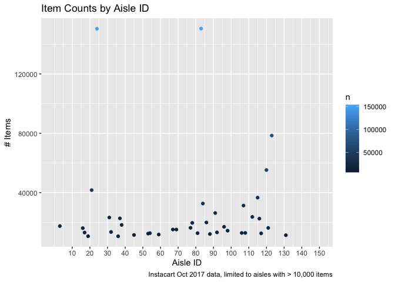

P8105 Homework 3
================
Alice Tivarovsky
10/6/2019

## Problem 1

### Instacart Data

Loading data and generating preview:

``` r
library(p8105.datasets)
data("instacart")
view(head(instacart, n = 50))
```

The instacart dataset contains 1,384,617 observations and 15 variables.
It catalogues instacart orders from October 2017 in New York City. Key
variables include order\_id (the order identifier), user\_id (the
customer identifier), product\_id (the product name within each order),
and order\_dow (the day of the week). The first row, for example, is
order\_id = 1, meaning it was the first order in October 2017, includes
(among 7 other items) the item product\_name = Bulgarian Yogurt, which
was ordered by customer user\_id = 112108 on order\_dow = 4 (presumably
Wednesday).

### EDA with Instacart Dataset

Counting \# of aisles and aisles most commonly ordered from.

``` r
pop_aisle = 
  count(instacart, aisle_id) %>% 
  arrange(desc(n))

pop_aisle
```

    ## # A tibble: 134 x 2
    ##    aisle_id      n
    ##       <int>  <int>
    ##  1       83 150609
    ##  2       24 150473
    ##  3      123  78493
    ##  4      120  55240
    ##  5       21  41699
    ##  6      115  36617
    ##  7       84  32644
    ##  8      107  31269
    ##  9       91  26240
    ## 10      112  23635
    ## # … with 124 more rows

There are 134 aisles and the aisle most commonly ordered from is aisle
83 (150609 items).

Keeping only aisles with n \> 10,000, creating a plot that shows the
number of items ordered in each aisle.

``` r
instacart %>% 
  select(aisle_id, product_name) %>% 
  group_by(aisle_id) %>% 
  summarize(n = n()) %>% 
  filter(n > 10000) %>% 
  ggplot(aes(x = aisle_id, y = n, color = n)) + geom_point() + 
  labs(
    title = "Item Counts by Aisle ID",
    x = "Aisle ID",
    y = "# Items",
    caption = "Instacart Oct 2017 data, limited to aisles with > 10,000 items") +
  scale_x_continuous(
    breaks = c(10, 20, 30, 40, 50, 60, 70, 80, 90, 100, 110, 120, 130, 140, 150), 
    labels = c("10", "20", "30", "40", "50", "60", "70", "80", "90", "100", "110", "120", "130", "140", "150"),
    limits = c(0, 150))
```

<!-- -->

``` r
  scale_y_continuous(
    breaks = c(10000, 20000, 30000, 40000, 50000, 60000, 70000, 80000, 90000, 100000, 110000, 120000, 130000, 140000, 150000)
  )
```

    ## <ScaleContinuousPosition>
    ##  Range:  
    ##  Limits:    0 --    1

Creating a table showing the three most popular items in each of the
aisles “baking ingredients”, “dog food care”, and “packaged vegetables
fruits”.

``` r
instacart %>% 
  filter(aisle == c("baking ingredients", "dog food care", "packaged vegetables fruits")) %>% 
  select(order_id, aisle, product_name) %>% 
  group_by(aisle, product_name) %>% 
  summarize(n = n()) %>% 
  mutate(product_rank = min_rank(desc(n))) %>% 
  filter(product_rank <= 3) %>% 
  arrange(aisle, product_rank) %>% 
knitr::kable()
```

| aisle                      | product\_name                                   |    n | product\_rank |
| :------------------------- | :---------------------------------------------- | ---: | ------------: |
| baking ingredients         | Light Brown Sugar                               |  157 |             1 |
| baking ingredients         | Pure Baking Soda                                |  140 |             2 |
| baking ingredients         | Organic Vanilla Extract                         |  122 |             3 |
| dog food care              | Organix Grain Free Chicken & Vegetable Dog Food |   14 |             1 |
| dog food care              | Organix Chicken & Brown Rice Recipe             |   13 |             2 |
| dog food care              | Original Dry Dog                                |    9 |             3 |
| packaged vegetables fruits | Organic Baby Spinach                            | 3324 |             1 |
| packaged vegetables fruits | Organic Raspberries                             | 1920 |             2 |
| packaged vegetables fruits | Organic Blueberries                             | 1692 |             3 |

Make a table showing the mean hour of the day at which Pink Lady Apples
and Coffee Ice Cream are ordered on each day of the week; format this
table for human readers (i.e. produce a 2 x 7 table).

``` r
instacart %>% 
  filter(product_name == c("Pink Lady Apples", "Coffee Ice Cream")) %>% 
  select(product_name, order_dow, order_hour_of_day) %>% 
  group_by(product_name, order_dow) %>% 
  summarize(mean_hour = mean(order_hour_of_day)) %>% 
  pivot_wider(
    names_from = order_dow,
    values_from = mean_hour
  ) %>% 
  knitr::kable()
```

    ## Warning in product_name == c("Pink Lady Apples", "Coffee Ice Cream"):
    ## longer object length is not a multiple of shorter object length

| product\_name    |        0 |        1 |        2 |       3 |        4 |        5 |        6 |
| :--------------- | -------: | -------: | -------: | ------: | -------: | -------: | -------: |
| Coffee Ice Cream | 13.22222 | 15.00000 | 15.33333 | 15.4000 | 15.16667 | 10.33333 | 12.35294 |
| Pink Lady Apples | 12.25000 | 11.67857 | 12.00000 | 13.9375 | 11.90909 | 13.86957 | 11.55556 |

## Problem 2

Loading BRFSS dataset.

``` r
library(p8105.datasets)
data("brfss_smart2010")
view(brfss_smart2010)
```

The dataset contains 134,203 observations and 23 variables.

``` r
brfss_smart2010 %>% 
  janitor::clean_names() %>% 
  rename(state = locationabbr, county = locationdesc) %>% 
  count(topic = "Overall Health")
```

    ## # A tibble: 1 x 2
    ##   topic               n
    ##   <chr>           <int>
    ## 1 Overall Health 134203
