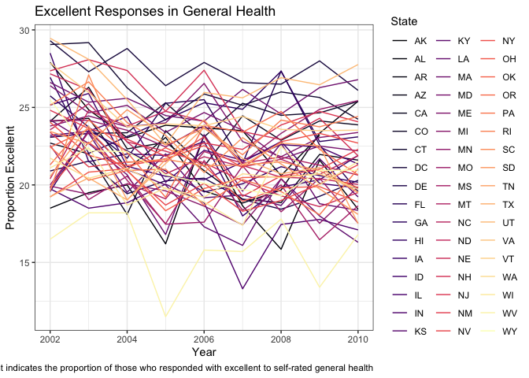

P8105 Homework 3
================
Alice Tivarovsky
10/6/2019

## Problem 1

### Instacart Data

Loading data and generating preview:

``` r
library(p8105.datasets)
data("instacart")
view(head(instacart, n = 50))

instacart
```

    ## # A tibble: 1,384,617 x 15
    ##    order_id product_id add_to_cart_ord… reordered user_id eval_set
    ##       <int>      <int>            <int>     <int>   <int> <chr>   
    ##  1        1      49302                1         1  112108 train   
    ##  2        1      11109                2         1  112108 train   
    ##  3        1      10246                3         0  112108 train   
    ##  4        1      49683                4         0  112108 train   
    ##  5        1      43633                5         1  112108 train   
    ##  6        1      13176                6         0  112108 train   
    ##  7        1      47209                7         0  112108 train   
    ##  8        1      22035                8         1  112108 train   
    ##  9       36      39612                1         0   79431 train   
    ## 10       36      19660                2         1   79431 train   
    ## # … with 1,384,607 more rows, and 9 more variables: order_number <int>,
    ## #   order_dow <int>, order_hour_of_day <int>,
    ## #   days_since_prior_order <int>, product_name <chr>, aisle_id <int>,
    ## #   department_id <int>, aisle <chr>, department <chr>

The instacart dataset contains 1,384,617 observations and 15 variables.
It catalogues instacart orders from October 2017 in New York City. Key
variables include order\_id (the order identifier), user\_id (the
customer identifier), product\_id (the product name within each order),
and order\_dow (the day of the week). The first row, for example, is
order\_id = 1, meaning it was the first order in October 2017, includes
(among 7 other items) the item product\_name = Bulgarian Yogurt, which
was ordered by customer user\_id = 112108 on order\_dow = 4 (presumably
Wednesday).

### EDA with Instacart Dataset

Counting \# of aisles and aisles most commonly ordered from:

``` r
pop_aisle = 
  count(instacart, aisle_id) %>% 
  arrange(desc(n))

pop_aisle
```

    ## # A tibble: 134 x 2
    ##    aisle_id      n
    ##       <int>  <int>
    ##  1       83 150609
    ##  2       24 150473
    ##  3      123  78493
    ##  4      120  55240
    ##  5       21  41699
    ##  6      115  36617
    ##  7       84  32644
    ##  8      107  31269
    ##  9       91  26240
    ## 10      112  23635
    ## # … with 124 more rows

There are 134 aisles and the aisle most commonly ordered from is aisle
83 (150609 items).

Keeping only aisles with n \> 10,000, creating a plot that shows the
number of items ordered in each aisle:

``` r
instacart %>% 
  select(aisle_id, product_name) %>% 
  group_by(aisle_id) %>% 
  summarize(n = n()) %>% 
  filter(n > 10000) %>% 
  ggplot(aes(x = aisle_id, y = n, color = n)) + geom_point() + 
  labs(
    title = "Item Counts by Aisle ID",
    x = "Aisle ID",
    y = "# Items",
    caption = "Instacart Oct 2017 data, limited to aisles with > 10,000 items") +
  scale_x_continuous(
    breaks = c(10, 20, 30, 40, 50, 60, 70, 80, 90, 100, 110, 120, 130, 140, 150), 
    labels = c("10", "20", "30", "40", "50", "60", "70", "80", "90", "100", "110", "120", "130", "140", "150"),
    limits = c(0, 150))
```

<!-- -->

``` r
  scale_y_continuous(
    breaks = c(10000, 20000, 30000, 40000, 50000, 60000, 70000, 80000, 90000, 100000, 110000, 120000, 130000, 140000, 150000)
  )
```

    ## <ScaleContinuousPosition>
    ##  Range:  
    ##  Limits:    0 --    1

Creating a table displaying the three most popular items in each of the
aisles “baking ingredients”, “dog food care”, and “packaged vegetables
fruits”:

``` r
instacart %>% 
  filter(aisle == c("baking ingredients", "dog food care", "packaged vegetables fruits")) %>% 
  select(order_id, aisle, product_name) %>% 
  group_by(aisle, product_name) %>% 
  summarize(n = n()) %>% 
  mutate(product_rank = min_rank(desc(n))) %>% 
  filter(product_rank <= 3) %>% 
  arrange(aisle, product_rank) %>% 
knitr::kable()
```

| aisle                      | product\_name                                   |    n | product\_rank |
| :------------------------- | :---------------------------------------------- | ---: | ------------: |
| baking ingredients         | Light Brown Sugar                               |  157 |             1 |
| baking ingredients         | Pure Baking Soda                                |  140 |             2 |
| baking ingredients         | Organic Vanilla Extract                         |  122 |             3 |
| dog food care              | Organix Grain Free Chicken & Vegetable Dog Food |   14 |             1 |
| dog food care              | Organix Chicken & Brown Rice Recipe             |   13 |             2 |
| dog food care              | Original Dry Dog                                |    9 |             3 |
| packaged vegetables fruits | Organic Baby Spinach                            | 3324 |             1 |
| packaged vegetables fruits | Organic Raspberries                             | 1920 |             2 |
| packaged vegetables fruits | Organic Blueberries                             | 1692 |             3 |

Creating a table showing the mean hour of the day at which Pink Lady
Apples and Coffee Ice Cream are ordered on each day of the week:

``` r
instacart %>% 
  filter(product_name == c("Pink Lady Apples", "Coffee Ice Cream")) %>% 
  select(product_name, order_dow, order_hour_of_day) %>% 
  group_by(product_name, order_dow) %>% 
  summarize(mean_hour = mean(order_hour_of_day)) %>% 
  pivot_wider(
    names_from = order_dow,
    values_from = mean_hour
  ) %>% 
  knitr::kable()
```

    ## Warning in product_name == c("Pink Lady Apples", "Coffee Ice Cream"):
    ## longer object length is not a multiple of shorter object length

| product\_name    |        0 |        1 |        2 |       3 |        4 |        5 |        6 |
| :--------------- | -------: | -------: | -------: | ------: | -------: | -------: | -------: |
| Coffee Ice Cream | 13.22222 | 15.00000 | 15.33333 | 15.4000 | 15.16667 | 10.33333 | 12.35294 |
| Pink Lady Apples | 12.25000 | 11.67857 | 12.00000 | 13.9375 | 11.90909 | 13.86957 | 11.55556 |

## Problem 2

Loading BRFSS dataset:

``` r
library(p8105.datasets)
data("brfss_smart2010")
view(head(brfss_smart2010, n = 100))

brfss_smart2010
```

    ## # A tibble: 134,203 x 23
    ##     Year Locationabbr Locationdesc Class Topic Question Response
    ##    <int> <chr>        <chr>        <chr> <chr> <chr>    <chr>   
    ##  1  2010 AL           AL - Jeffer… Heal… Over… How is … Excelle…
    ##  2  2010 AL           AL - Jeffer… Heal… Over… How is … Very go…
    ##  3  2010 AL           AL - Jeffer… Heal… Over… How is … Good    
    ##  4  2010 AL           AL - Jeffer… Heal… Over… How is … Fair    
    ##  5  2010 AL           AL - Jeffer… Heal… Over… How is … Poor    
    ##  6  2010 AL           AL - Jeffer… Heal… Fair… Health … Good or…
    ##  7  2010 AL           AL - Jeffer… Heal… Fair… Health … Fair or…
    ##  8  2010 AL           AL - Jeffer… Heal… Heal… Do you … Yes     
    ##  9  2010 AL           AL - Jeffer… Heal… Heal… Do you … No      
    ## 10  2010 AL           AL - Jeffer… Heal… Unde… Adults … Yes     
    ## # … with 134,193 more rows, and 16 more variables: Sample_Size <int>,
    ## #   Data_value <dbl>, Confidence_limit_Low <dbl>,
    ## #   Confidence_limit_High <dbl>, Display_order <int>,
    ## #   Data_value_unit <chr>, Data_value_type <chr>,
    ## #   Data_Value_Footnote_Symbol <chr>, Data_Value_Footnote <chr>,
    ## #   DataSource <chr>, ClassId <chr>, TopicId <chr>, LocationID <chr>,
    ## #   QuestionID <chr>, RESPID <chr>, GeoLocation <chr>

The dataset contains 134,203 observations and 23 variables.

Cleaning data, focusing on “Overall Health”, taking responses from
“Excellent” to “Poor”, and organizing responses as factors ranging
from “Excellent” to “Poor”:

``` r
brfss_clean = 
  brfss_smart2010 %>% 
  janitor::clean_names() %>% 
  rename(state = locationabbr, county = locationdesc, respondents = sample_size) %>%
  filter(topic == "Overall Health") %>% 
  mutate(response_fac = factor(response, levels = c("Excellent", "Very good", "Good", "Fair", "Poor"))) 

brfss_clean
```

    ## # A tibble: 10,625 x 24
    ##     year state county class topic question response respondents data_value
    ##    <int> <chr> <chr>  <chr> <chr> <chr>    <chr>          <int>      <dbl>
    ##  1  2010 AL    AL - … Heal… Over… How is … Excelle…          94       18.9
    ##  2  2010 AL    AL - … Heal… Over… How is … Very go…         148       30  
    ##  3  2010 AL    AL - … Heal… Over… How is … Good             208       33.1
    ##  4  2010 AL    AL - … Heal… Over… How is … Fair             107       12.5
    ##  5  2010 AL    AL - … Heal… Over… How is … Poor              45        5.5
    ##  6  2010 AL    AL - … Heal… Over… How is … Excelle…          91       15.6
    ##  7  2010 AL    AL - … Heal… Over… How is … Very go…         177       31.3
    ##  8  2010 AL    AL - … Heal… Over… How is … Good             224       31.2
    ##  9  2010 AL    AL - … Heal… Over… How is … Fair             120       15.5
    ## 10  2010 AL    AL - … Heal… Over… How is … Poor              66        6.4
    ## # … with 10,615 more rows, and 15 more variables:
    ## #   confidence_limit_low <dbl>, confidence_limit_high <dbl>,
    ## #   display_order <int>, data_value_unit <chr>, data_value_type <chr>,
    ## #   data_value_footnote_symbol <chr>, data_value_footnote <chr>,
    ## #   data_source <chr>, class_id <chr>, topic_id <chr>, location_id <chr>,
    ## #   question_id <chr>, respid <chr>, geo_location <chr>,
    ## #   response_fac <fct>

Locations by state in 2002:

``` r
brfss_clean %>% 
  filter(year == 2002) %>% 
  select(state, county) %>% 
  group_by(state) %>% 
  summarize(n = n_distinct(county)) %>% 
  filter(n >= 7)
```

    ## # A tibble: 6 x 2
    ##   state     n
    ##   <chr> <int>
    ## 1 CT        7
    ## 2 FL        7
    ## 3 MA        8
    ## 4 NC        7
    ## 5 NJ        8
    ## 6 PA       10

In 2002, there were 6 states with 7 or more locations represented: CT,
FL, MA, NC, NJ, and PA.

Locations by state in 2010:

``` r
brfss_clean %>% 
  filter(year == 2010) %>% 
  select(state, county) %>% 
  group_by(state) %>% 
  summarize(n = n_distinct(county)) %>% 
  filter(n >= 7)
```

    ## # A tibble: 14 x 2
    ##    state     n
    ##    <chr> <int>
    ##  1 CA       12
    ##  2 CO        7
    ##  3 FL       41
    ##  4 MA        9
    ##  5 MD       12
    ##  6 NC       12
    ##  7 NE       10
    ##  8 NJ       19
    ##  9 NY        9
    ## 10 OH        8
    ## 11 PA        7
    ## 12 SC        7
    ## 13 TX       16
    ## 14 WA       10

In 2010, there are 14 states with 7 or more locations represented: CA,
CO, FL, MA, MD, NC, NE, NJ, NY, OH, PA, SC, TX, and WA.

Constructing a dataset limited to Excellent responses, and containing
year, state, and a variable that averages the data\_value across
locations within a state:

``` r
brfss_excellent = 
brfss_clean %>% 
  filter(response == "Excellent") %>% 
  select(year, state, county, data_value) %>% 
  drop_na() %>% 
  group_by(year, state) %>% 
  summarize(n = mean(data_value))

brfss_excellent
```

    ## # A tibble: 443 x 3
    ## # Groups:   year [9]
    ##     year state     n
    ##    <int> <chr> <dbl>
    ##  1  2002 AK     27.9
    ##  2  2002 AL     18.5
    ##  3  2002 AR     24.1
    ##  4  2002 AZ     24.1
    ##  5  2002 CA     22.7
    ##  6  2002 CO     23.1
    ##  7  2002 CT     29.1
    ##  8  2002 DC     29.3
    ##  9  2002 DE     20.9
    ## 10  2002 FL     25.7
    ## # … with 433 more rows

Creating spaghetti plot of average value over time within a state:

``` r
brfss_excellent %>% 
  ggplot(aes(x = year, y = n)) + 
  geom_line(aes(group = state, color = state)) +
  viridis::scale_color_viridis(
    name = "State", 
    discrete = TRUE, 
    option = "magma"
  ) + 
   labs(
    title = "Excellent Responses in General Health",
    x = "Year",
    y = "Proportion Excellent", 
    caption = "Proportion Excellent indicates the proportion of those who responded with excellent to self-rated general health"
   ) +
  theme_bw()
```

<!-- -->

Creating a two-panel plot showing, for the years 2006, and 2010,
distribution of data\_value for responses (“Poor” to “Excellent”) among
locations in NY State:

``` r
brfss_clean %>% 
  filter(year %in% c(2006,2010), state == "NY") %>% 
  select(year, state, county, response, data_value) %>% 
  ggplot(aes(x = response, y = data_value, color = state)) + 
    geom_boxplot() + 
    facet_grid(. ~ year) +  
  labs(
    title = "Distribution of Self-Rated Health in NY",
    x = "Response",
    y = "Proportion"
  ) + 
  theme_bw()
```

<!-- -->

## Problem 3

Lodaing and tidying the accel\_data dataset. We see that the original
dataset has activity for every minute of the day as its own variable. We
want to pivot the data so that minutes are observations (rows) and
activity is the data (values). We do this using pivot\_longer. We then
rename activity to minute and round all the activity values to two
digits and convert activity to a numeric vector. Finally, we add a
variable to indicate whether the line item corresponds to a weekend
observation (day = Saturday or Sunday) or a weekday observation (day =
Monday - Friday).

``` r
accel_data = 
  read.csv("./accel_data.csv") %>% 
  janitor::clean_names() %>% 
  pivot_longer(
    activity_1:activity_1440,
    names_to = "minute",
    names_prefix = "activity_",
    values_to = "activity"
  ) %>% 
  mutate(activity = as.double(activity)) %>% 
  mutate(activity = round(activity, digits = 2)) %>% 
  mutate(minute = as.numeric(minute)) %>% 
  mutate(wkday_wkend = if_else(day %in% c("Saturday", "Sunday"), "weekend", "weekday"))

accel_data
```

    ## # A tibble: 50,400 x 6
    ##     week day_id day    minute activity wkday_wkend
    ##    <int>  <int> <fct>   <dbl>    <dbl> <chr>      
    ##  1     1      1 Friday      1     88.4 weekday    
    ##  2     1      1 Friday      2     82.2 weekday    
    ##  3     1      1 Friday      3     64.4 weekday    
    ##  4     1      1 Friday      4     70.0 weekday    
    ##  5     1      1 Friday      5     75.0 weekday    
    ##  6     1      1 Friday      6     66.3 weekday    
    ##  7     1      1 Friday      7     53.8 weekday    
    ##  8     1      1 Friday      8     47.8 weekday    
    ##  9     1      1 Friday      9     55.5 weekday    
    ## 10     1      1 Friday     10     43.0 weekday    
    ## # … with 50,390 more rows

Now we create a total activity variable for each of the 35 days
represented, and create a table of the resulting dataset.

``` r
accel_data %>% 
  group_by(day_id, day) %>% 
  summarize(n = sum(activity)) %>% 
  knitr::kable()
```

| day\_id | day       |         n |
| ------: | :-------- | --------: |
|       1 | Friday    | 480542.61 |
|       2 | Monday    |  78828.18 |
|       3 | Saturday  | 376254.00 |
|       4 | Sunday    | 631105.00 |
|       5 | Thursday  | 355923.72 |
|       6 | Tuesday   | 307094.19 |
|       7 | Wednesday | 340115.01 |
|       8 | Friday    | 568839.00 |
|       9 | Monday    | 295431.00 |
|      10 | Saturday  | 607175.00 |
|      11 | Sunday    | 422018.00 |
|      12 | Thursday  | 474048.00 |
|      13 | Tuesday   | 423245.00 |
|      14 | Wednesday | 440962.00 |
|      15 | Friday    | 467420.00 |
|      16 | Monday    | 685910.00 |
|      17 | Saturday  | 382928.00 |
|      18 | Sunday    | 467052.00 |
|      19 | Thursday  | 371230.00 |
|      20 | Tuesday   | 381507.00 |
|      21 | Wednesday | 468869.00 |
|      22 | Friday    | 154049.00 |
|      23 | Monday    | 409450.00 |
|      24 | Saturday  |   1440.00 |
|      25 | Sunday    | 260617.00 |
|      26 | Thursday  | 340291.00 |
|      27 | Tuesday   | 319568.00 |
|      28 | Wednesday | 434460.00 |
|      29 | Friday    | 620860.00 |
|      30 | Monday    | 389080.00 |
|      31 | Saturday  |   1440.00 |
|      32 | Sunday    | 138421.00 |
|      33 | Thursday  | 549658.00 |
|      34 | Tuesday   | 367824.00 |
|      35 | Wednesday | 445366.00 |

It is difficult to detect any trend just looking at the table. We see
that in general, though, Saturdays appear to be the least active day.

We next plot activity as a function of the minute of each hour of the
day. We aggregate over hour and sum over activity, segregating the data
by day of week.

``` r
  accel_data %>% 
  mutate(hour = minute %/% 60) %>% 
  group_by(day, hour) %>% 
  summarize(n = sum(activity)) %>% 
  ggplot(aes(x = hour, y = n)) +
    geom_line(aes(color = day)) +
    labs(
    x = "Hour", 
    y = "Activity",
    title = "Activity by Hour") +
    scale_y_continuous(
    breaks = c(50000, 100000, 150000, 200000, 250000, 300000)
  )
```

<!-- -->

Based on this graph, we see that in general for this individual, the
highest activity points are between hour 17 and 21 (i.e. between 5pm and
9pm). We see that Sunday deviates from this pattern, activity peaking
around 11am and declining throughout the day. We see that the lowest
activity points are between hour 0 and hour 5, and that activity
initiates around 6am, with the exception of Wednesday and Thursday, when
it initiates before 5am.
